# UGREEN DXP LED CLI

Friendly LED control for UGREEN DXP NAS systems running Debian or Proxmox. It gives you persistent health/resource modes and temporary effects that restore the previous state when they finish or when you press Ctrl-C.

This project wraps and pins the hardware controller from [miskcoo/ugreen_leds_controller](https://github.com/miskcoo/ugreen_leds_controller). That project did the I2C reverse-engineering; this repository adds the user-facing command, safe temporary effects, configuration, tests, and boot service.

## Visual manual

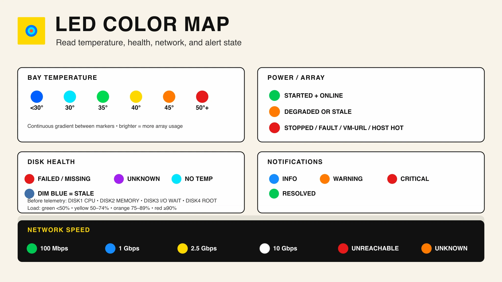

Every primary command family, shortcut, and lifecycle action has a matching
visual card. The complete copyable
manual and artwork regeneration instructions live in
[`docs/manual`](docs/manual/README.md).

<details>
<summary><strong>Open all 17 command cards</strong></summary>

| Setup and inspection | Persistent modes |
| --- | --- |
| [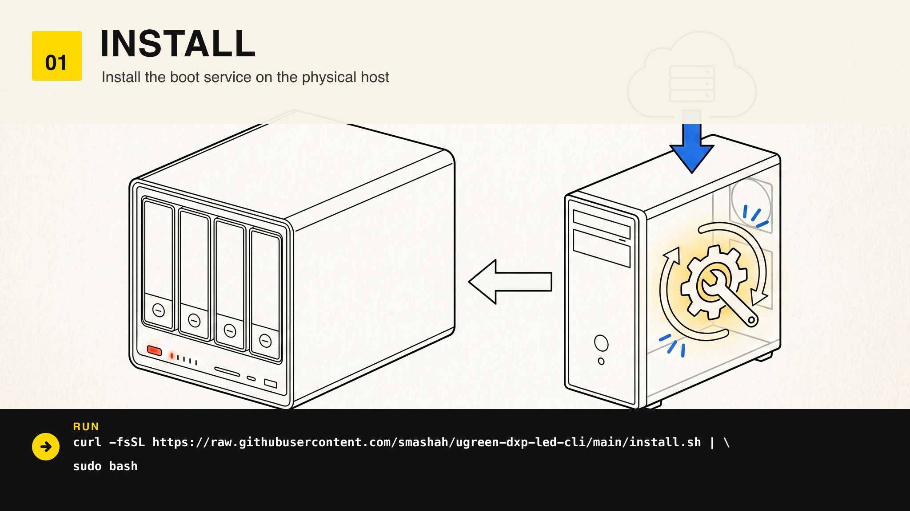](docs/manual/README.md#01--install) | [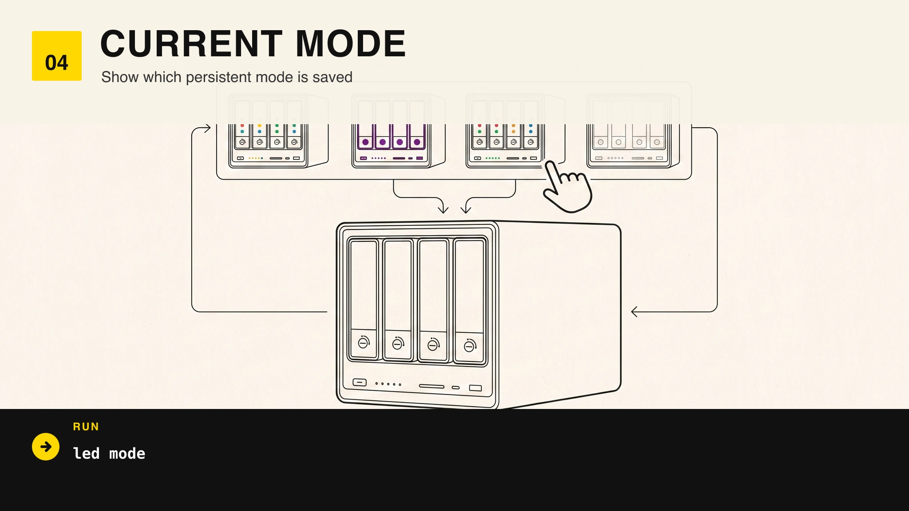](docs/manual/README.md#04--current-mode) |
| [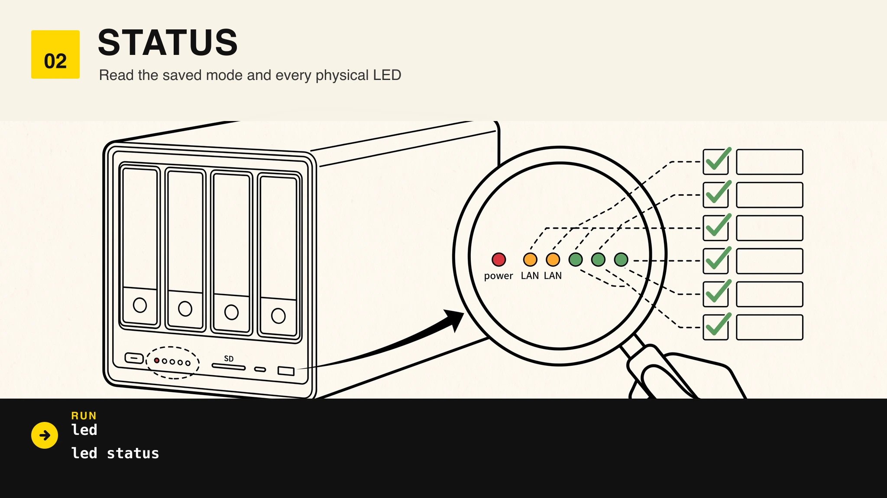](docs/manual/README.md#02--status) | [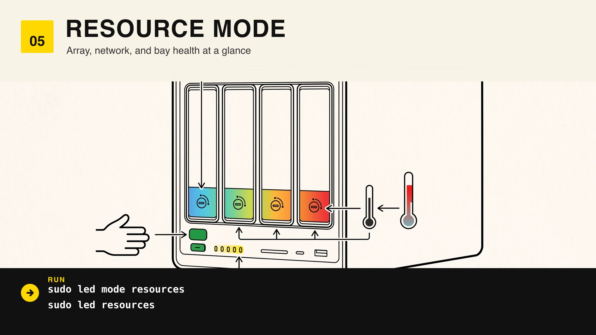](docs/manual/README.md#05--resources) |
| [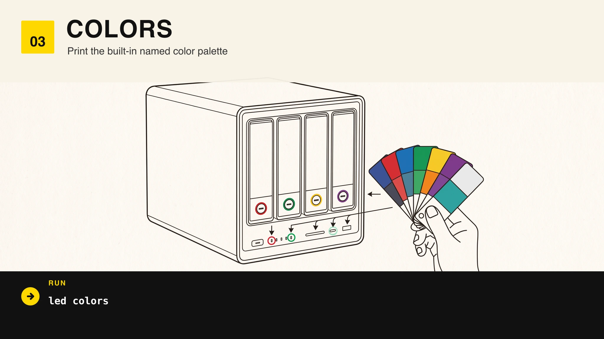](docs/manual/README.md#03--colors) | [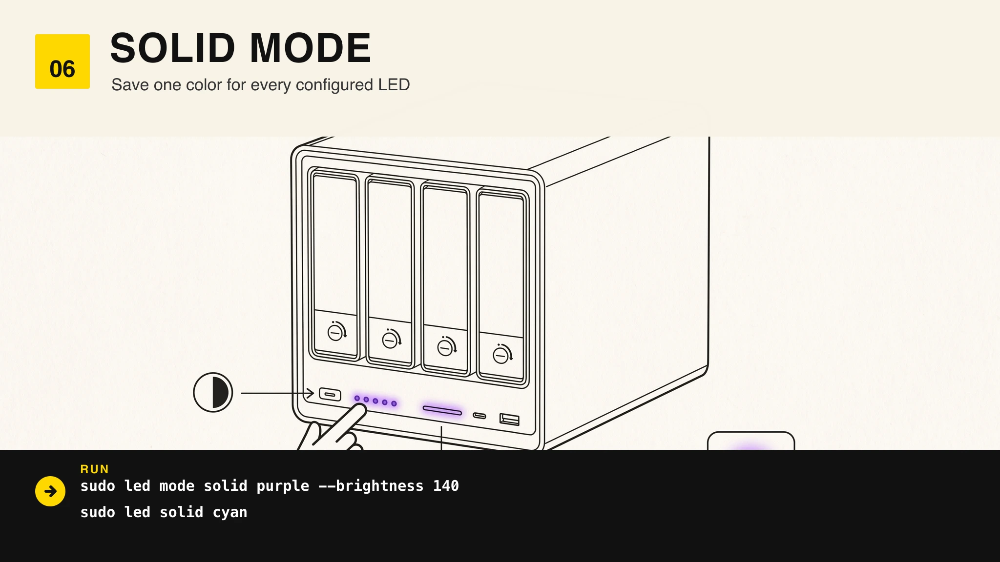](docs/manual/README.md#06--solid) |
| [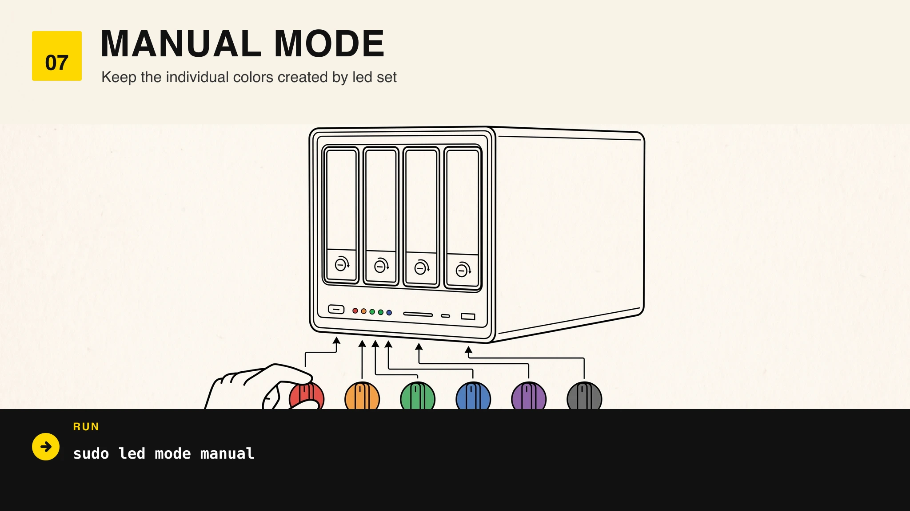](docs/manual/README.md#07--manual) | [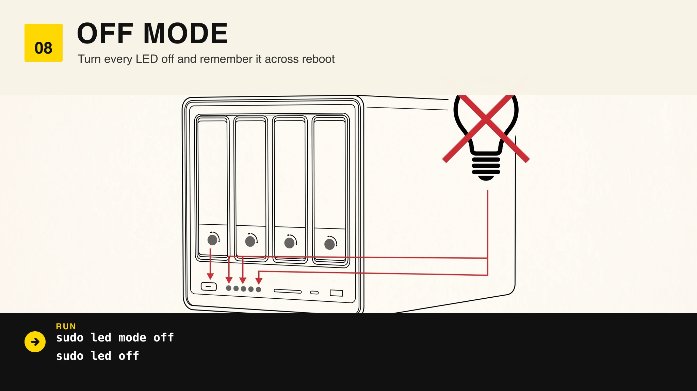](docs/manual/README.md#08--off) |
| [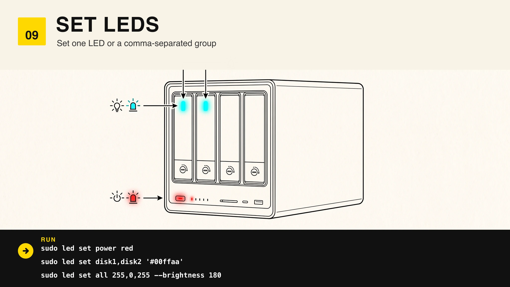](docs/manual/README.md#09--set-leds) | |

| Effects and lifecycle | Effects and lifecycle |
| --- | --- |
| [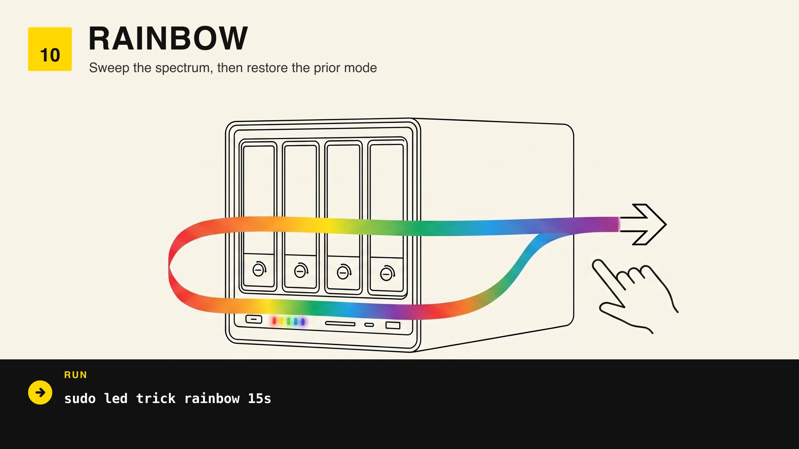](docs/manual/README.md#10--rainbow) | [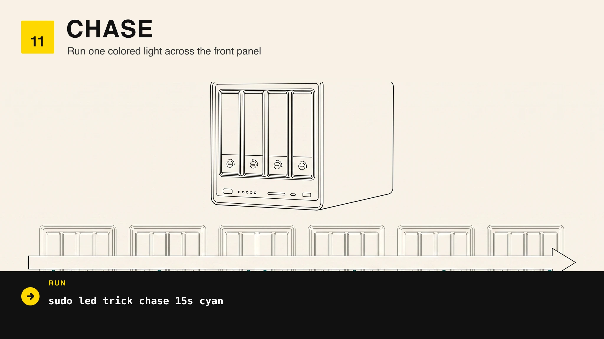](docs/manual/README.md#11--chase) |
| [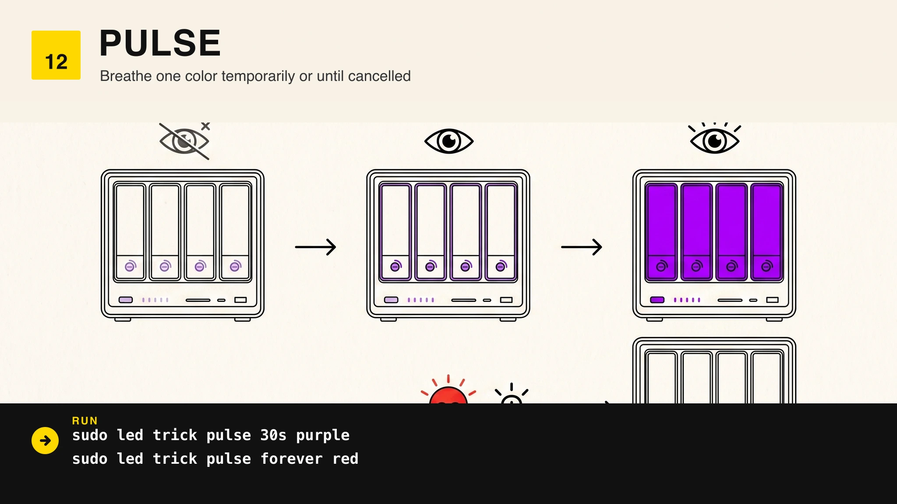](docs/manual/README.md#12--pulse) | [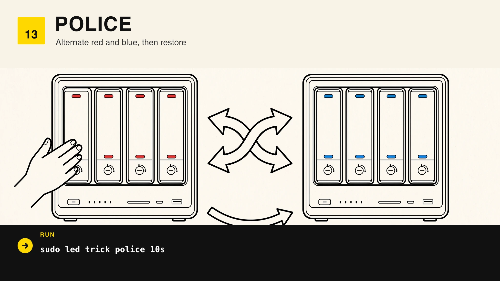](docs/manual/README.md#13--police) |
| [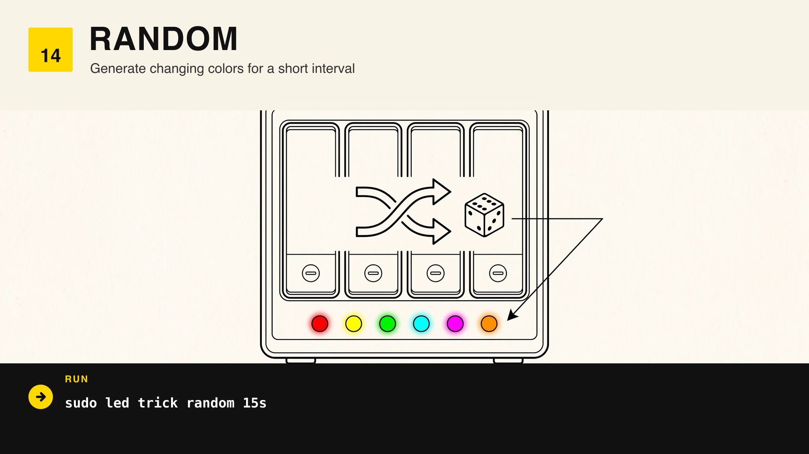](docs/manual/README.md#14--random) | [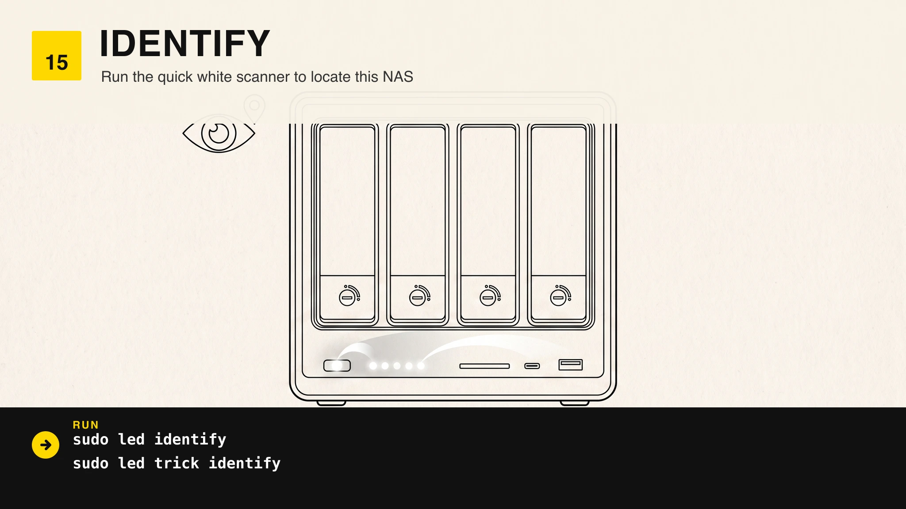](docs/manual/README.md#15--identify) |
| [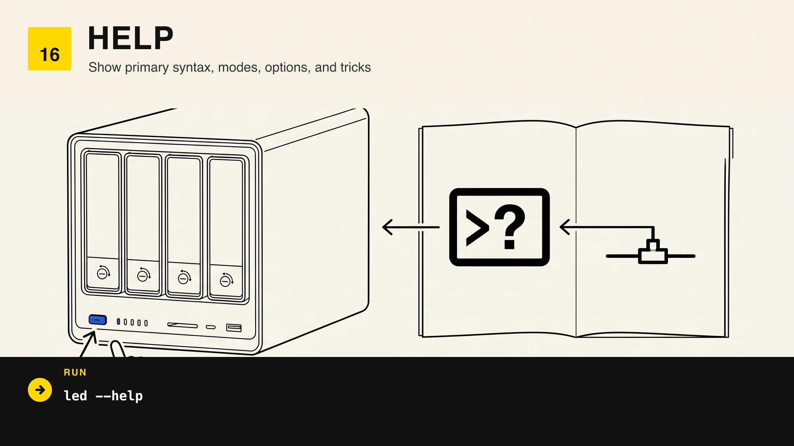](docs/manual/README.md#16--help) | [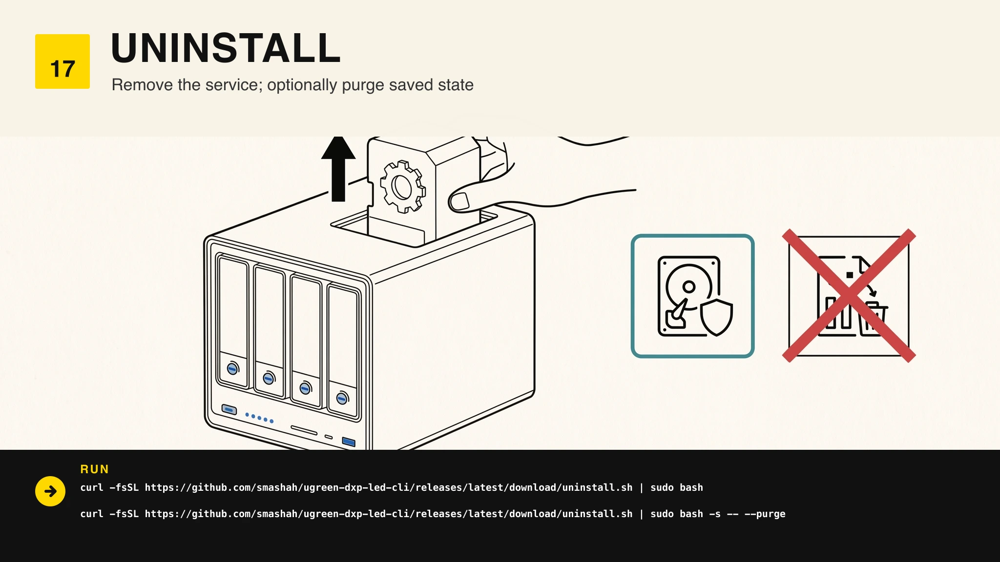](docs/manual/README.md#17--uninstall) |

</details>

Tested on:

- UGREEN DXP4800 Plus
- Proxmox VE 8.x and 9.x
- The onboard I801 SMBus controller at address `0x3a`
- `power`, `netdev`, and `disk1` through `disk4`

## Install

Run this on the physical Proxmox or Debian host. The LED controller cannot be managed from a VM unless you pass its I2C controller through.

```sh
curl -fsSL https://raw.githubusercontent.com/smashah/ugreen-dxp-led-cli/main/install.sh | sudo bash
```

Resource mode can include a Proxmox VM and HTTP health check in the power LED:

```sh
curl -fsSL https://raw.githubusercontent.com/smashah/ugreen-dxp-led-cli/main/install.sh | \
  sudo bash -s -- --interface enp6s0 --vm-id 504 --health-url https://192.168.1.27/
```

Install the optional authenticated API when a VM or monitoring service needs
to control the LEDs. Bind it to the host's specific LAN address:

```sh
curl -fsSL https://raw.githubusercontent.com/smashah/ugreen-dxp-led-cli/main/install.sh | \
  sudo bash -s -- --with-api --api-listen 192.168.1.10
```

The installer refuses to run alongside known UGREEN LED services. Once you have a rollback copy of their configuration, replace them explicitly:

```sh
sudo ./install.sh --replace-existing
```

## Usage

```sh
led status
led mode resources
led mode solid purple --brightness 140
led set power red
led set disk1,disk2 '#00ffaa'
led set all 255,0,255 --brightness 180
led mode manual
led mode off
```

Shortcuts are available for common mode changes:

```sh
led resources
led solid cyan
led off
```

Changes to `resources`, `solid`, `manual`, and `off` are saved in `/etc/ugreen-led-cli.conf` and applied again at boot.

## Temporary tricks

```sh
led trick rainbow 15s
led trick chase 15s cyan
led trick pulse 30s purple
led trick police 10s
led trick random 15s
led identify
led trick pulse forever red
```

Tricks run for 15 seconds by default and accept durations from 1 to 300 seconds. `forever` runs until Ctrl-C or an API cancellation. The command stops the persistent LED service, snapshots the current lights, runs the effect, restores the snapshot, and restarts the service if it was active. Interruption follows the same restore path.

Colors can be named, `#RRGGBB`, or `R,G,B`. Run `led colors` for the built-in palette.

## HTTP API

The API uses Python's standard library and has no runtime package dependencies.
`/v1/health` is public; every control and status endpoint requires the bearer
token stored in `/etc/ugreen-led-api.token` with mode `0600`.

```sh
token=$(sudo cat /etc/ugreen-led-api.token)
api=http://192.168.1.10:9842

curl -fsS "$api/v1/status" \
  -H "Authorization: Bearer $token"

curl -fsS "$api/v1/effects" \
  -H "Authorization: Bearer $token" \
  -H 'Content-Type: application/json' \
  -d '{"effect":"rainbow","duration":"15s"}'

curl -fsS -X DELETE "$api/v1/effects/current" \
  -H "Authorization: Bearer $token"

curl -fsS "$api/v1/mode" \
  -H "Authorization: Bearer $token" \
  -H 'Content-Type: application/json' \
  -d '{"mode":"solid","color":"cyan","brightness":140}'
```

Unraid can push its array and four-bay state to the same authenticated API.
The server timestamps and atomically persists the validated payload; resource
mode picks it up without restarting either service:

```sh
curl -fsS "$api/v1/telemetry" \
  -H "Authorization: Bearer $token" \
  -H 'Content-Type: application/json' \
  -d '{
    "source":"unraid",
    "array":{"state":"STARTED","health":"ONLINE","usage_percent":61},
    "disks":[
      {"slot":1,"name":"main","device":"sdb","temperature_c":34,"status":"OK","usage_percent":61},
      {"slot":2,"name":"main2","device":"sdc","temperature_c":36,"status":"OK","usage_percent":61}
    ]
  }'

curl -fsS "$api/v1/telemetry" \
  -H "Authorization: Bearer $token"
```

Only one effect runs at a time. Notifications replace the current effect, which
lets a monitoring alert take priority over a decorative animation:

```sh
# NUT: utility power was lost. Pulse red until recovery clears it.
curl -fsS "$api/v1/notifications" \
  -H "Authorization: Bearer $token" \
  -H 'Content-Type: application/json' \
  -d '{"level":"critical","message":"UPS on battery","duration":"forever"}'

# NUT: utility power returned. Replace red with a 10-second green pulse.
curl -fsS "$api/v1/notifications" \
  -H "Authorization: Bearer $token" \
  -H 'Content-Type: application/json' \
  -d '{"level":"resolved","message":"Utility power restored","duration":"10s"}'
```

Notification levels map to blue (`info`), orange (`warning`), red (`critical`),
and green (`resolved`). Messages are written to the API service journal and are
never interpreted as commands.

The API is plain HTTP because it is intended for a trusted host-only or LAN
network. Bind to a specific address, keep port `9842` behind the host firewall,
and use a TLS reverse proxy or VPN before exposing it beyond that network.

```sh
systemctl status ugreen-led-api.service
journalctl -u ugreen-led-api.service
```

## Resource mode

With fresh Unraid telemetry, the default six LEDs provide an array dashboard:

| LED | Meaning |
| --- | --- |
| `power` | Green for a started/online array; orange for degraded or stale telemetry; red for a stopped/faulted array, failed VM/URL check, or critical host temperature. |
| `netdev` | Link speed color when the default gateway answers; red when it does not. |
| `disk1`–`disk4` | Corresponding Unraid bay temperature and health. Brightness rises with array usage. |

Disk temperatures move along a continuous gradient: blue below 30°C, cyan at
30°C, green at 35°C, yellow at 40°C, orange at 45°C, and red at 50°C or above.
That makes small differences between healthy bays visible instead of painting
the whole 30–39°C range identically. A missing or failed disk is red, unknown
health is purple, and unavailable temperature is cyan.
Telemetry expires after 90 seconds by default; stale disk data becomes dim blue
instead of continuing to claim a healthy temperature. Temporary effects and
notifications preempt this display, then restore the latest telemetry state.

Before the first telemetry payload, resource mode remains backward compatible:
the disk LEDs show host CPU, memory, I/O wait, and root-filesystem usage.
Network colors are green at 100 Mbps, blue at 1 Gbps, yellow at 2.5 Gbps, and
white at 10 Gbps.

## Configuration

Edit `/etc/ugreen-led-cli.conf`, then restart the service:

```sh
sudo systemctl restart ugreen-led-mode.service
sudo systemctl restart ugreen-led-api.service
```

The main settings are `MODE`, `BRIGHTNESS`, `REFRESH_SECONDS`, `INTERFACE`,
`VM_ID`, `HEALTH_URL`, `TEMP_WARN_C`, `TEMP_CRIT_C`, `TELEMETRY_FILE`, and
`TELEMETRY_TTL_SECONDS`. See [`config.example`](config.example) for the full
file.

## Uninstall

Keep the saved configuration by default:

```sh
curl -fsSL https://github.com/smashah/ugreen-dxp-led-cli/releases/latest/download/uninstall.sh | \
  sudo bash
```

Remove configuration and manual LED state too:

```sh
curl -fsSL https://github.com/smashah/ugreen-dxp-led-cli/releases/latest/download/uninstall.sh | \
  sudo bash -s -- --purge
```

## Development

The smoke suite uses a stateful fake controller, so it exercises modes and exact trick restoration without touching hardware:

```sh
make test
```

Release builds compile the backend from the pinned source documented in [`VENDOR.md`](VENDOR.md).

## Credits

Hardware access comes from [miskcoo/ugreen_leds_controller](https://github.com/miskcoo/ugreen_leds_controller), used under the MIT License. Please credit that project for the controller work.
